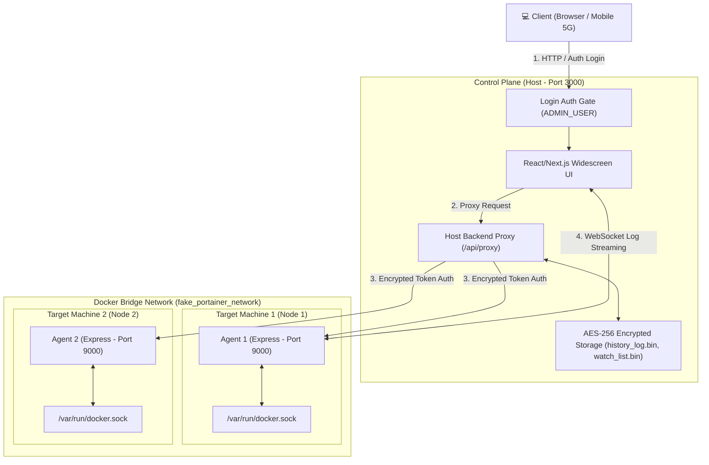

# 🐳 FakePortainer 프로젝트 발표 및 전체 시스템 가이드

---

## 📌 Slide 1. Cover (제목)

# 🐳 FakePortainer
### 경량 웹 기반 멀티 서버 Docker 관제 & 통합 제어 시스템
> **Portainer 대체용 풀 파노라마 관제 타워 | Host-Agent 아키텍처 | 실시간 로그 스트리밍**

- **작성일:** 2026년 8월 10일
- **기술 스택:** Next.js 14, Node.js Express, Docker, WebSocket, TypeScript, Tailwind CSS
- **저장소:** [Laser-Cho/FakePortainer](https://github.com/Laser-Cho/FakePortainer.git)

---

## 📌 Slide 2. Executive Summary (프로젝트 개요)

### 💡 개발 배경 및 목표
분산된 여러 타겟 서버의 Docker 컨테이너 현황을 하나의 대시보드에서 손쉽게 감시하고 제어할 수 있는 **초경량, 고보안 웹 기반 관제 시스템**을 구축합니다.

### 🌟 핵심 가치 (Key Core Values)
1. **통합 관제 (All-in-One Dashboard):** 
   - 개별 서버 단독 관제 및 클러스터 전체 노드 통합 관제 지원 (`All Nodes Cluster Overview`)
2. **외부망 통신 제약 극복:** 
   - Host 백엔드 프록시 중계 아키텍처로 DDNS, 사설 IP, 모바일 5G망 환경에서도 100% 통신 보장
3. **강력한 보안 & 데이터 암호화:** 
   - `ADMIN_USER` 로그인 게이트, `AGENT_SECRET_TOKEN` 토큰 인증, AES-256-CBC 데이터 바이너리 암호화 저장
4. **실시간 제어 & 이력 추적:** 
   - WebSocket 기반 터미널 로그 스트리밍, 컨테이너/이미지 삭제 안전 재확인 팝업, 작업 이력 페이지 제공

---

## 📌 Slide 3. System Architecture (전체 시스템 아키텍처)

### 🏗️ 분산 아키텍처 & 통신 흐름



> [!NOTE]
> **Host 프록시 중계 아키텍처:** 브라우저가 사설망 IP 에이전트에 직접 접근하지 못하는 경우에도, Host 백엔드가 Proxy 중계를 수행하여 언제 어디서나 정상 접속됩니다.

---

## 📌 Slide 4. Key Features - Control Plane & Dashboard

### 🖥️ 1. 풀 파노라마 다크 테마 대시보드
- **와이드스크린 반응형 UI (`max-w-[1920px]`):** 해상도를 인식하여 수평 스크롤 없이 시원한 관제 화면 제공
- **사이드바 네비게이션 (`Sidebar.tsx`):** 모든 등록된 노드의 헬스 상태(온라인/오프라인) 표출 및 1-클릭 머신 전환

### 📊 2. 메타데이터 상세 표출
| 구분 | 표출 항목 | 시각적 뱃지 테마 |
| :--- | :--- | :--- |
| **Docker Compose 출처** | 프로젝트명, 서비스명, compose.yml 출처 파일명 | 🟣 보라색 뱃지 |
| **Docker Network / Bridge** | 도커 브릿지 네트워크명, 내부 IP, 게이트웨이, MAC주소 | 🔵 시안색 뱃지 |
| **Node Machine** | 컨테이너가 가동 중인 호스트 머신 IP/이름 | 🔷 파란색 뱃지 |

---

## 📌 Slide 5. Key Features - All Nodes Cluster & Real-Time Operations

### 🌐 1. 클러스터 통합 관제 (`All Nodes Cluster Overview`)
- 클러스터 내 모든 에이전트 머신의 컨테이너 정보를 병렬(`Promise.all`)로 수집
- 전체 머신의 컨테이너 상태를 한 화면에서 일괄 조회, 시작, 정지, 재시작, 삭제 제어

### 📜 2. 실시간 터미널 로그 스트리밍 & 이미지 Prune
- **WebSocket 로그 뷰어 (`ServerLogModal.tsx`):**
  - WebSocket(`ws://`) 기반 실시간 터미널 스타일 다크 모달
  - 타겟 컨테이너의 stdout/stderr 로그를 딜레이 없이 실시간 스트리밍
- **Docker 이미지 Prune:**
  - 사용 중이지 않은 미사용(Dangling) 이미지를 한 번의 클릭으로 정단하게 일괄 Prune 삭제

---

## 📌 Slide 6. Security & Safety Mechanisms (보안 & 실수 방지)

### 🔒 1. 3중 보안 검증 체계
> [!IMPORTANT]
> **허가되지 않은 임의의 `curl` 명령이나 외부 공격으로부터 시스템을 완벽히 보호합니다.**

```carousel

<!-- slide -->
### 1단계: 풀스크린 환경변수 로그인 게이트
- `ADMIN_USER`, `ADMIN_PASSWORD` 미인증 시 대시보드 전면 차단 및 세션 쿠키 발급

### 2단계: 에이전트 보안 토큰 & JWT 인증 (`Agent/src/middleware/auth.js`)
- Authorization 헤더(`Bearer <AGENT_SECRET_TOKEN>`) 미포함 시 HTTP `401/403` 즉시 거부

### 3단계: 바이너리 암호화 데이터 저장 (AES-256-CBC)
- `watch_list.bin` 및 `history_log.bin`에 암호화 헤더(`FKPT_BIN:`, `FKPTHIST:`) 적용하여 저장
```

### 🛑 2. 삭제/제어 오동작 방지 팝업 (`ConfirmModal.tsx`)
- **컨테이너 및 이미지 삭제 시:** 대상 컨테이너/이미지의 **풀 네임을 동일하게 직접 입력**해야만 삭제 버튼 활성화
- **시작/정지/재시작 시:** 팝업 창을 통해 사용자의 명시적 재확인 클릭 후 명령 전송

---

## 📌 Slide 7. Network Architecture & Proxy Mechanism

### 🔄 Host 백엔드 프록시 (Proxy) 중계 원리

#### ❌ 기존 방식의 문제점:
- 브라우저(모바일 5G / 외부 DDNS 접속) ➔ 에이전트(사설 IP: `192.168.0.32`) 직접 호출 시 **Network Error 발생**

#### ✅ FakePortainer 프록시 해결책:
```
[사용자 브라우저 (외부망)]
       │
       ▼ (1. POST /api/proxy { targetUrl, path, method, payload })
[Host Control Plane 백엔드]
       │
       ▼ (2. 내부 사설망 Direct HTTP 통신)
[Agent Node (192.168.0.32:9000)]
```
- Host 서버 백엔드가 내부 사설 IP 에이전트와 직접 통신을 중계하므로 **모바일망, 외부 DDNS, 포트포워딩 환경 100% 지원**

---

## 📌 Slide 8. Deployment & Docker Compose Architecture

### 🐳 도커 컴포즈 & 네트워크 설계 (`fake_portainer_network`)

```yaml
# 네트워크 자동 생성 및 순서 무관 합류 레시피
services:
  fake-portainer-agent:
    image: fake-portainer-agent:latest
    ports: ["9000:9000"]
    volumes: [/var/run/docker.sock:/var/run/docker.sock]
    networks: [fake_portainer_network]

  fake-portainer-host:
    image: fake-portainer-host:latest
    ports: ["3000:3000"]
    volumes:
      - ./watch_list.txt:/app/watch_list.txt
      - ./history_log.bin:/app/history_log.bin
    networks: [fake_portainer_network]

networks:
  fake_portainer_network:
    name: fake_portainer_network  # 👈 실행 순서와 무관하게 없으면 생성, 있으면 합류
```

> [!TIP]
> **영구 데이터 마운트:** `watch_list.txt` 및 `history_log.bin` 볼륨 마운트로 컨테이너가 재생성되어도 노드 목록과 작업 이력 데이터가 영구 보존됩니다.

---

## 📌 Slide 9. Project Milestones (개발 마일스톤 현황)

### 📋 Phase 1 ~ Phase 13 완료 내역

- [x] **[Phase 1]** 프로젝트 셋업 및 Express/Next.js Dockerfile 구성
- [x] **[Phase 2]** Docker Socket 연동 및 컨테이너 목록 API 개발
- [x] **[Phase 3]** Next.js 기반 다크 테마 대시보드 UI 구현
- [x] **[Phase 4]** 컨테이너 Start / Stop / Restart / Remove 제어 연동
- [x] **[Phase 5]** WebSocket 기반 실시간 컨테이너 로그 스트리밍 구현
- [x] **[Phase 6]** 로컬 Docker 이미지 관리 및 Dangling Prune 구현
- [x] **[Phase 7]** 멀티 에이전트 동적 등록 및 10초 주기 헬스 체크
- [x] **[Phase 8]** Compose 출처 & Docker Bridge IP 메타데이터 표출
- [x] **[Phase 9]** `ADMIN_USER`, `ADMIN_PASSWORD` 강제 로그인 인증 게이트
- [x] **[Phase 10]** 사이드바 `Sidebar.tsx` 및 `All Nodes Cluster` 통합 관제
- [x] **[Phase 11]** Host 백엔드 프록시(`POST /api/proxy`) 중계 및 이력 추적/암호화 적용
- [x] **[Phase 12]** All Nodes Cluster 도커 볼륨 관제 통합 (`VolumeTable.tsx`)
- [x] **[Phase 13]** 컨테이너 연관 볼륨 선택적 동시 삭제 팝업 & Dynamic `APP_TITLE`


---

## 📌 Slide 10. Technology Stack Summary (기술 스택)

### 🛠️ 프론트엔드, 백엔드 & 인프라 요약

| 영역 | 기술 / 라이브러리 | 용도 |
| :--- | :--- | :--- |
| **Control Plane Frontend** | Next.js 14 (App Router), React, TypeScript | 웹 관제 대시보드 UI |
| **Control Plane Styling** | Tailwind CSS, Lucide React Icons | 와이드스크린 다크 모드 디자인 |
| **Control Plane Backend** | Next.js API Routes, Node Crypto | Proxy 중계 & AES-256-CBC 암호화 |
| **Agent Backend** | Node.js, Express, `dockerode` | Docker Daemon Socket 제어 API |
| **Realtime Stream** | WebSocket (`ws` 패키지) | 터미널 로그 실시간 중계 |
| **Container & Network** | Docker, Docker Compose (`fake_portainer_network`) | 멀티 컨테이너 오케스트레이션 |

---

## 📌 Slide 11. Conclusion & Q&A

### 🎯 결론 및 기대 효과
1. **운영 효율성 극대화:** 분산된 도커 서버들을 한 눈에 모니터링하고 1-클릭으로 제어
2. **보안 안정성 확보:** 암호화 토큰, 삭제 팝업 확인, AES-256 바이너리 데이터 저장으로 실수 및 침입 방지
3. **네트워크 가용성 100%:** 외부 DDNS 및 모바일망 환경 완벽 지원

---
### 👏 감사합니다! 질문이 있으시면 말씀해 주세요.
